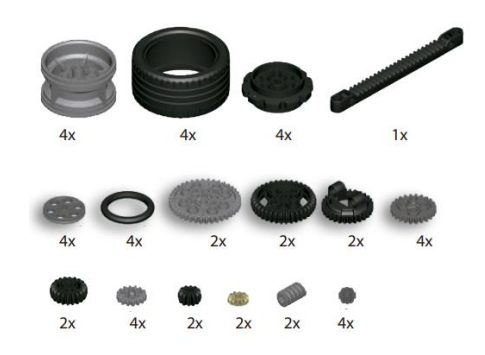
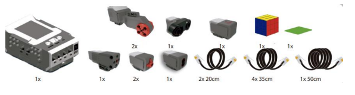
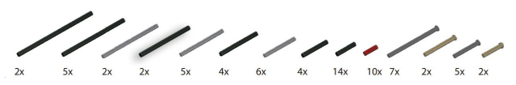
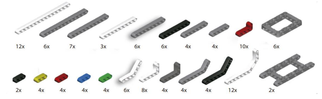
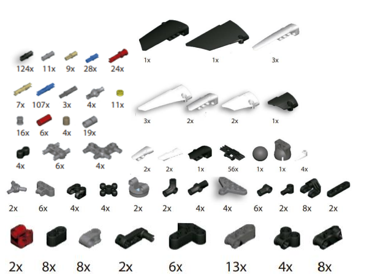
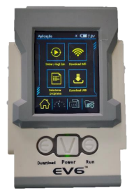
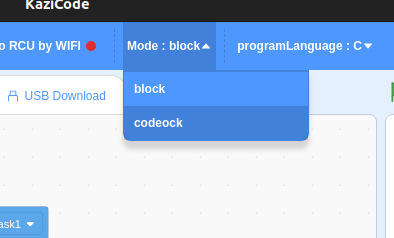
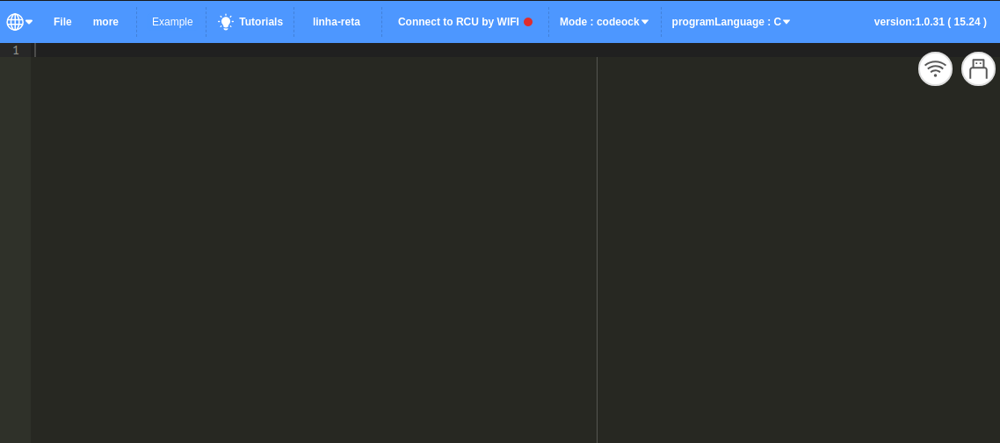
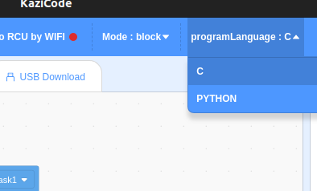

# EDO6-doc
Custom Personal Documentation for EDO6 Educational Robotics Kits
------------------------------------------------------------

*******
Tabelas de conteúdo 
 1. [Informações Relevantes](#info)
 2. [Componentes do Kit](#components)
 3. [KaziCode](#kazi)
    - [Download](#download)
    - [Programação](#programming)
    - [Usando linguagem C](/C_doc/)
    - [Usando Blocos](/blocos_doc/)
        - [Funções](/blocos_doc/#funcoes)
 4. [Base do carrinho](/base-motriz/)
 5. Sensores
    - [Ultrasonico](/aulas/aula_04-sensores/CODIGO-sensor_de_obstaculo/)
    - [Sensor de cor](/aulas/aula_04-sensores/CODIGO-sensor_de_cores_e_luz/)
    - [Sensor giroscópio](/aulas/aula_03-manipulacao/CODIGO-movimento_giroscopio/#custom_manipulation)

*******

  
  
  ## Info

 O **CONJUNTO DE ROBÓTICA EDUCIONAL ED06** apresenta aos estudantes a oportunidade de utilizar os conhecimentos teóricos, aplicando-os de forma prática por meio da construção de protótipos funcionais que, contextualizados, aperfeiçoam a qualidade do ensino e aprendizagem nas escolas.

 O kit é constituído por mais de 750 peças plásticas que possibilitam a realização de atividades em grupos de 2 a 4 alunos através da tipologia e quantidade adequada de cada tipo de peças e que exploram diferentes áreas do conhecimento – *ciência, tecnologia, engenharia, artes e matemática* – por meio da construção de montagens sem motorização, com motorização e/ou automatizadas (máquinas, equipamentos, etc.), utilizando, para tanto peças plásticas facilmente encaixáveis ( ou não  ¯\\\_(ツ)\_/¯ ), não dependendo do uso de ferramentas. 
 
 Todos os itens apresentam plena compatibilidade mecânica e eletrônica com as peças de montar e a interface eletrônica.

  ## Componentes do Kit

 - Rodas, Pneus, e engrenagem.

    

 - Sensores, Atuadores, Cabo e outros.
 
    

 - Eixos

    

 - Vigas

    

 - Conectores e peças complementares diversas

    

   - Componentes eletrônicos plugáveis 

      - 01 Motor de corrente contínua de 5V, tamanho médio.
      - 02 Sensores de toque.
      - 02 Motor de corrente continua de 5v,tamanho grande
      - 01 Sensor de Distancia Ultrassônico
      - 01 Sensor giroscópio
      - 01 Sensor de cor
  - Especificações do software
    - Programação em bloco e todos os ícones em português
    - Compatível com os sistemas operacionais Linux e Windows
    - Criação de jogos com personagens e fundo
  - Unidade de controle arquitetura ARM
    - Configuração da bateria
      - Bateria: Fornecimento externo de energia, suporta 6 pilhas/ bateria de lítio 2200mA
      - Modo de carregamento: carregamento da bateria de lítio
      - Capacidade da bateria: 220mAh
      - Tensão de carregamento: 8,4V
      - Tempo de carregamento: 2.2hrs
      - Tempo de uso: aproximadamente 3 horas.
    - Característica da Tela
      - Memória interna/ memória flash: 512KB/8MB (expansível)
      - TFT: 2.4 polegadas, tela colorida
      - Toque: touchScreen
      - Exibição: Português, exibindo números, textos e imagens etc.
      - Resolução: 320×240 pixels

    - Configuração do sistema:
      - Controlador programável: Corext-M3
      - Sistema: sistema real-time
      - Frequência básica: 7.2Mhz
      - RAM/USB: 64Mb/2.0
      - WIFI/MP3: tipo esportivo
      - Compatibilidade: Android/IOS/Windows
      - Programa de desenvolvimento: SCRATCH 3.0
      - Tipo de comunicação de controle: WIFI
      - Botão: 1 botão de força e 2 teclas de função
      - Entrada RJ12 para sensores: 8
      - Saídas RJ12 para motores
     
         

          

         

  - A controladora é programável por software do tipo Scratch. A interface utiliza como fonte de alimentação conexão USB através de computador ou baterias recarregáveis instaladas internamente em formato de case além de possibilidade de utilizar fonte externa DC. O cabo USB e baterias (e seus respectivos carregadores) e fonte externa DC estão inclusos no kit.

 
 

## Download KaziCode

|OS   |LINK |
---  |  ---  |
|Windows	     | [KaziCode_Setup_1.0.32.rar](http://file.kazi.ai/Public/file/KaziCode%20Setup%201.0.32_en.rar) |
|Linux  | [scratch-en-linux.zip](http://file.kazi.ai/Public/file/scratch-en-linux.zip) |

_Caso o download não seja feito e o navegador esteja barrando, copie o endereço do link, cole a url no navegador e ao iniciar o download clique em 'manter'_

## Programação

 #### No kazi code podemos optar por programar no modelo do scratch (Códigos em bloco) ou escolher alguma linguagem como C ou Python. Por padrão o Kazi irá abrir em modo de código em bloco

- Para realizar a troca do modo de programação selecione o modo de coding desejado no menu superior:
   

    

- O modo codeock será o modo de programação utilizado para as linguagens selecionadas
     
     
    
     
     
- Para selecionar a linguagem desejada basta escolher no menu superior ao lado do modo de programação:
  

  
