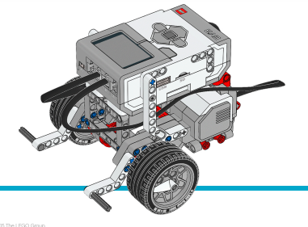

# Base Motriz (carrinho/Robô) para usar ao decorrer das aulas

**A Base Motriz é uma plataforma robótica modular.** 

_Pode ser estendida e reconfigurada confirme necessário. Adicionar sensores permite que ela reaja ao seu ambiente e faça coisas como detectar obstáculos e evitar colisões._

----

Mantenha a Base Motriz montada depois de usar, em vez de desmontá-la.

---