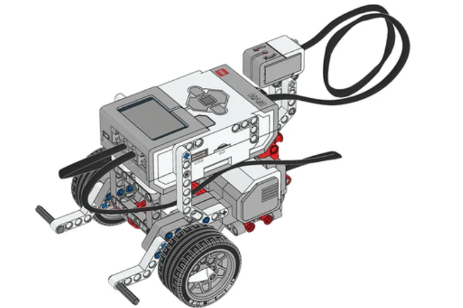

## Sensor giroscópio

 - O sensor giroscópio deve estar completamente estático quando estiver sendo conectado ao bloco EV3 e durante a inicialização do bloco EV3. Se a leitura do ângulo do sensor giroscópio mudar enquanto a Base Motriz estiver parada, desconecte o sensor e conecte novamente.
  

  
  
 
  [🎥 EXEMPLO DE FUNCIONAMENTO](https://legoeducation.23video.com/v.ihtml/player.html?token=d52b0f6a8d68f2a3db237f8066959073&source=embed&photo%5fid=55847242&autoPlay=0&autoMute=0&hideBigPlay=1&showDescriptions=0)
    
   

