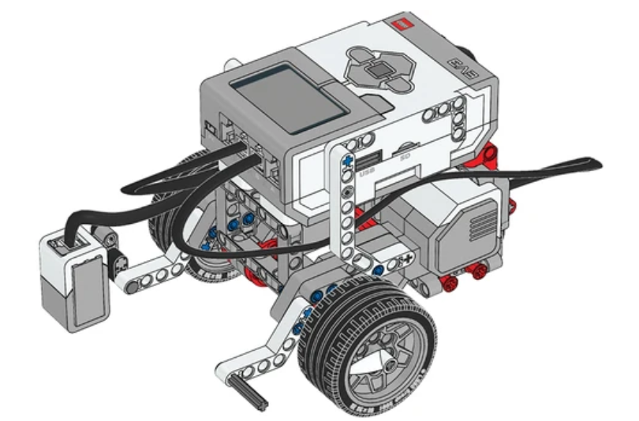

## Sensor de cores

- Precisaremos da extensão do sensor de cor para baixo para detectar e seguir linhas. Construa-o na Base Motriz.

  

- FUNCIONAMENTO: https://legoeducation.23video.com/v.ihtml/player.html?token=e1e9580bb6b513559d9b5c0097262f1d&source=embed&photo%5fid=55847239&autoPlay=0&autoMute=0&hideBigPlay=1&showDescriptions=0