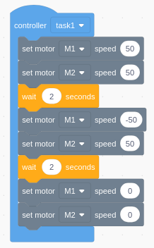
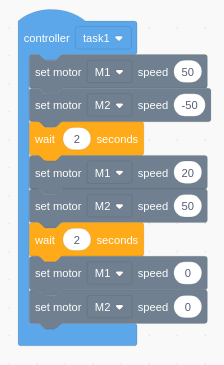

## Código em blocos

- #### Linha Reta
    _O carrinho deve mover-se para frente, após 2 segundos mover-se para trás e após 2 segundos parar seus motores_

    

- #### Realizando curva (método alternativo)

    _O carrinho deve realizar uma volta em 360 graus, após 2 segundos realizar uma curva suave e por fim parar seus motores_

    