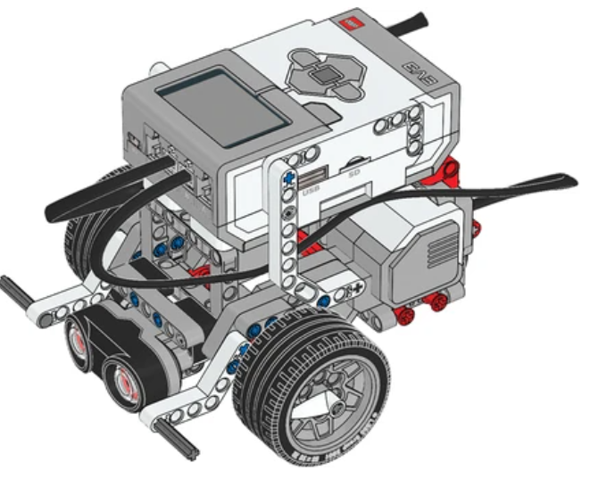

## Sensor Ultrassônico

### Construa o Cuboide e sua extensão.

- Você vai precisar da extensão do Sensor Ultrassônico para detectar objetos e obstáculos. Construa o Cuboide e, então construa a extensão na Base Motriz.

 
 

  
  

 
 

 [🎥 EXEMPLO DE FUNCIONAMENTO](https://legoeducation.23video.com/v.ihtml/player.html?token=4b1f8248a6c5647255fcc3bf32276e76&source=embed&photo%5fid=55847235&autoPlay=0&autoMute=0&hideBigPlay=1&showDescriptions=0)

